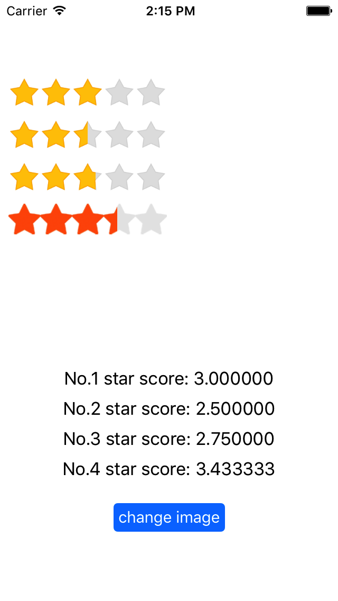

# AWERatingBar
an iOS RatingBar

## Screenshots



## Requirements

`AWERatingBar` works on Xcode 7.3 , iOS 7.0+  and requires ARC to build. 
You will need the latest developer tools in order to build `AWERatingBar`. Old Xcode versions might work, but compatibility will not be explicitly maintained.

## CocoaPods

CocoaPods is the recommended way to add `AWERatingBar` to your project.

Add a pod entry for JHUD to your Podfile.

```
pod 'AWERatingBar', '~> 0.1.0'
```
Second, install JHUD into your project:

```
pod install
```
Include JHUD wherever you need it with `#import "AWERatingBar.h"`.

## Manually

1. Download the latest code version .
2. Open your project in Xcode,drag the `AWERatingBar` folder into your project.  Make sure to select Copy items when asked if you extracted the code archive outside of your project.
3. You need it with `#import "AWERatingBar.h"`.

## Usage

#### Delegate
```
-(instancetype)initWithFrame:(CGRect)frame;
-(instancetype)initWithFrame:(CGRect)frame displayRating:(CGFloat)rating;
-(instancetype)initWithFrame:(CGRect)frame numberOfStars:(NSInteger)numberOfStars rateStyle:(RateStyle)rateStyle anination:(BOOL)animation delegate:(id)delegate;
```

#### Block
```
-(instancetype)initWithFrame:(CGRect)frame finish:(finishBlock)finish;
-(instancetype)initWithFrame:(CGRect)frame numberOfStars:(NSInteger)numberOfStars rateStyle:(RateStyle)rateStyle isAnination:(BOOL)isAnimation finish:(finishBlock)finish;
```

#### Display Rating
```
-(void)displayRating:(CGFloat)rating isIndicator:(BOOL)isIndicator;
```

#### Set Star Image
```
- (void)setStarImageWithNormalStar: (UIImage *)normalStar selectedStar: (UIImage *)selectedStar;
```

## Contacts

#### If you wish to contact me, email at: 17086448791@163.com

## License

`AWERatingBar` is released under the [MIT license](LICENSE). See LICENSE for details.

